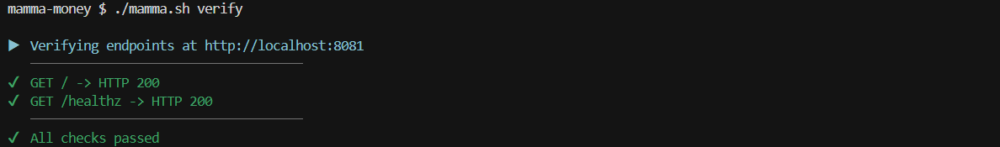
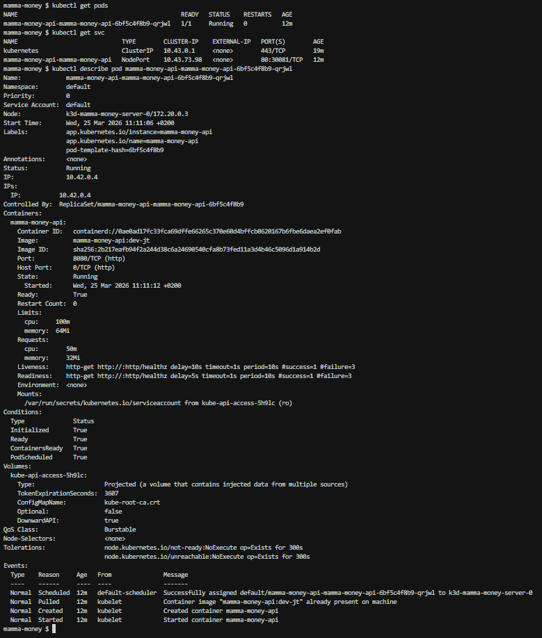

# Assessor Notes

This document exists to keep `README.md` focused on a clean entry point while still documenting evidence and any intentional deviations from the assessment schema.

## Local cluster evidence: `localhost:8081` vs `HOST_PORT` + NodePort mapping

The assessment bonus suggests:
- port-forwarding (or otherwise exposing) the service to `http://localhost:8081/`
- capturing screenshots proving:
  - the app is reachable at `http://localhost:8081/`
  - the health check at `http://localhost:8081/healthz`
  - `kubectl get pods` and `kubectl get svc` showing healthy resources

This repo captures evidence via the same URL construction for both Docker and Kubernetes:
- `BASE_URL = <HOST_PROTOCOL>://<HOST_SERVER_NAME>:<HOST_PORT>` (from `ops/.env`)
- `mamma.sh verify` curls `/` and `/healthz` at `BASE_URL`

With the default configuration, `HOST_PORT=8080`, so the screenshots below demonstrate the workflow at `http://localhost:8080/` rather than `8081`.

To reproduce the assessment's exact `8081` URLs, set `HOST_PORT=8081` in `ops/.env` and keep `NODE_PORT` consistent (it is injected into Helm at deploy time via `--set service.nodePort=...` in `mamma.sh`). Then rerun `cluster`, `deploy`, and `verify`.

## Repo layout deviation: Dockerfile/Helm under `src/` instead of repository root

The assessment schema asks for the `Dockerfile` and Helm chart in the repository root.

This implementation intentionally keeps application artefacts under `src/` and reserves the repo root for operational tooling (`mamma.sh`, `ops/.env`, CI). The trade-offs are:
- Docker build context is scoped to `src/` (`DOCKER_BUILD_CONTEXT=src`) to avoid sending unnecessary files
- `mamma.sh` explicitly references `src/Dockerfile` and deploys `src/helm/mamma-money-api` (with the shared `src/helm/lib-common` dependency)

This keeps the operational surface area small and makes build/deploy behaviour easier to reason about.

## CI workflow filename convention: `ci.yaml` vs `ci.yml`

The schema specifies `.github/workflows/ci.yml`, but this repository uses `.github/workflows/ci.yaml`.

We deviate from the schema naming convention for consistency with the rest of the project:
- all other YAML files in the repo follow the `.yaml` extension convention (for example `codeql.yaml` and Helm values like `values.local.yaml`)
- this reduces confusion for new developers on the local project conventions

Trade-off note (why `.yaml`):
- GitHub Actions will recognize workflow files placed under `.github/workflows/` even when using `.yaml` naming.
- Helm chart tooling in this repo is authored and documented using `.yaml`-suffixed template/values files; using `.yml` would introduce an extension mismatch against that local convention.

Functionally, the workflow still runs as expected in GitHub, while preserving a consistent extension convention for local development.

## Where this project can still improve

- There is no unit testing for the core operational scripts, usually I follow TDD but I did not in this instance.  Writing tests for python would be easier that writing them for bash and so if I was to take this to production I would probably convert the mamma.sh to a python script, add pytest and possibly som pre-commit hooks.
- Regression tests in the CI.  This is always nice to have but since the deployments wer focused on local, I stuck with the status checks and liveness probes.  
- Remote deployment.  I instinctively wanted to write terraform code to throw this out to the cloud, several times but that would have been way out of scope and only useful as an extra. In production, that would be a hard requirement or at least multiple targets would be so thats a nice one for future work, should this code ever be extended.

## Thank you

I want to say thank you to the team at Mamma Money for giving me this opportunity and I look very much forward to discussing it further with you in person.

Sincerely,

[Jeán Thysse](https://www.thysse.org.za)

## See also

- [Local k3d cluster workflow + embedded evidence images](ops.md)
- [Docker build/run/verify documentation + embedded evidence images](docker.md)
- [Project entry point used for navigation and onboarding](../README.md)

## Requirement alignment

