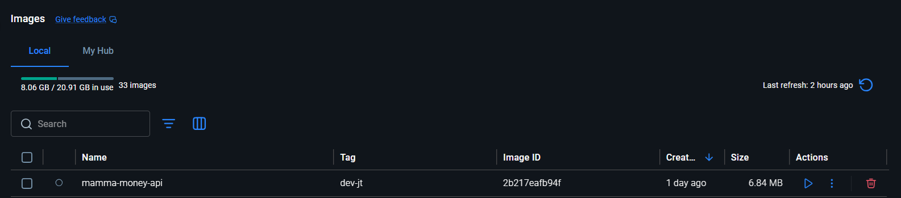
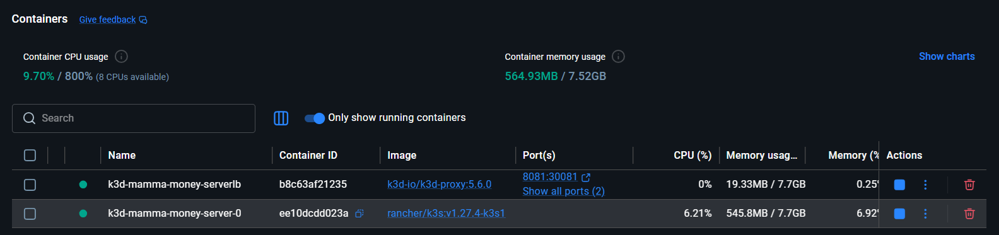

# Docker

The service is containerised using a multi-stage Docker build at `src/Dockerfile`. This document explains the architecture decisions and their trade-offs.

## Repository layout

The assessment specification lists Dockerfile and Helm/chart artefacts at repository root level. In this repository, equivalent artefacts are under `src/`, as provided in the starter structure.

All source code — Go application, Dockerfile, and Helm charts — lives under `src/`. The repository root is reserved for operations: shell scripts, environment configuration, and CI. This separation keeps application implementation and operational tooling clearly partitioned.

The trade-off is a layout difference from the specification examples, documented explicitly in this document. The Docker build context is scoped to `src/` (`DOCKER_BUILD_CONTEXT=src` in `ops/.env`), and the Dockerfile is referenced by `mamma.sh` during build execution.

## What the image provides

- A two-stage build that keeps the Go toolchain out of the final image entirely
- A `distroless/static` runtime image — no shell, no package manager, nothing an attacker can use
- Non-root execution via the `nonroot` user baked into the distroless image
- BuildKit cache mounts so incremental rebuilds only recompile what changed



## Runtime behaviour

The server listens on `PORT` (defaults to `8080`) and exposes two endpoints:

- `GET /` → `Hello, World!`
- `GET /healthz` → `ok`

## Local development

Review [README](../README.md) before running local container workflows. Refer especially to:

- [Pre-requisites](../README.md#prerequisites)
- [Operator Flow](../README.md#operator-flow---run-with-docker)
- [First-run checklist](../README.md#first-run-checklist)
- [Shell Compatibility](../README.md#shell-compatibility)
- [Troubleshooting](../README.md#troubleshooting)

The `TARGET_PLATFORM` value in `ops/.env` controls the build target and should match deployment architecture. Example: Apple Silicon development targeting x86 should keep `TARGET_PLATFORM=linux/amd64`.

```bash
bash ./mamma.sh build   # builds and loads the image into local Docker
bash ./mamma.sh run     # runs the container on port 8080
bash ./mamma.sh verify  # hits / and /healthz to confirm the container is up
```



### Platform and cross-compilation

The Dockerfile is configured for cross-compilation. The builder stage runs on `$BUILDPLATFORM`, and the Go compiler targets `TARGET_PLATFORM` from `ops/.env` via `GOOS`/`GOARCH`. This allows native-speed builds for cross-architecture targets without emulation.

This matters when deploying to AWS Graviton (t4g, m7g, c7g instances), which are ARM-based and typically 20–40% cheaper than equivalent x86 instances. Setting `TARGET_PLATFORM=linux/arm64` in `.env` produces a Graviton-compatible image from any machine without any other changes.

## Dockerfile walk-through

### Builder stage

```dockerfile
# syntax=docker/dockerfile:1.7
FROM --platform=$BUILDPLATFORM golang:1.22-alpine AS builder
```

The parser directive at the top pins the BuildKit frontend to 1.7, which is what unlocks the `--mount=type=cache` syntax used later. Without it, older Docker daemons would silently ignore those cache mounts and every build would start cold.

Alpine is used for the builder rather than the full Debian-based Go image. The Go toolchain dominates the layer size either way, but Alpine cuts the noise. The usual concern with Alpine — that it uses `musl libc` instead of `glibc` — doesn't apply here because `CGO_ENABLED=0` means the binary never links against libc at all.

```dockerfile
COPY app/go.mod app/go.sum ./
RUN --mount=type=cache,target=/go/pkg/mod \
    go mod download
```

`go.mod` and `go.sum` are copied before application source so Docker can cache dependency download as an independent layer. If application code changes without dependency changes, `go mod download` is skipped via layer cache. The `--mount=type=cache` further persists module cache across builds even when the layer cache is invalidated.

`go.sum` is currently empty because this service has no external dependencies, but it needs to exist and be committed. The moment a dependency is added via `go get`, `go.sum` gets populated with checksums, and `go mod download` will fail in CI without it.

```dockerfile
COPY app/ ./
```

Source is copied after dependencies, intentionally. Reversing this order would mean any source change busts the `go mod download` cache, defeating the purpose of the split.

```dockerfile
ARG TARGETOS
ARG TARGETARCH
RUN --mount=type=cache,target=/root/.cache/go-build \
    CGO_ENABLED=0 GOOS=${TARGETOS:-linux} GOARCH=${TARGETARCH:-amd64} \
    go build -trimpath -ldflags="-s -w" -o /out/server ./main.go
```

`TARGETOS` and `TARGETARCH` are populated automatically by BuildKit from the `--platform` flag and fed into `GOOS`/`GOARCH`, which is how Go's compiler knows to produce a binary for the target rather than the build machine.

`CGO_ENABLED=0` produces a fully static binary with no shared library dependencies. This is what makes it possible to run in `distroless/static`, which contains no libc. The trade-off is that packages with CGO dependencies (certain database drivers, sqlite bindings) won't compile — acceptable for a standard HTTP service.

The `--mount=type=cache` on the Go build cache means only changed packages are recompiled on subsequent builds. On larger codebases this is the difference between a 30-second rebuild and a 3-minute one.

`-trimpath` removes local filesystem paths from the compiled binary. Without it, stack traces can embed machine-specific paths and reduce reproducibility across build environments.

`-ldflags="-s -w"` strips symbol table (`-s`) and DWARF debug information (`-w`). This typically reduces binary size by 20-30%. The trade-off is reduced runtime debuggability; local reproduction builds can omit these flags when deep debugging is required.

The binary is written to `/out/server`, outside the source tree, so the `COPY` in the next stage has a clean, unambiguous target.

### Runtime stage

```dockerfile
FROM gcr.io/distroless/static-debian12:nonroot AS runtime
```

`distroless/static` contains timezone data, CA certificates, and nothing else — no shell, no package manager, no `curl`. The attack surface in the running container is essentially just the application binary itself. If an attacker achieves code execution, they have no tools to work with.

The `nonroot` variant configures the image to run as UID 65532. This happens at the image level rather than through a `USER` directive, so it can't be accidentally dropped. `debian12` pins the base to a specific Debian release for predictable CVE patching cycles.

The only meaningful operational trade-off is that `docker exec -it <container> /bin/sh` doesn't work — there's no shell to exec into. For Kubernetes deployments, `kubectl debug` with an ephemeral container is the correct approach. For local debugging, run the application directly with `go run` rather than through the container.

```dockerfile
COPY --from=builder /out/server /server
```

This is the only file that makes it into the final image from the build stage. The Go toolchain, source code, module cache, and all intermediate build artefacts are discarded.

```dockerfile
EXPOSE 8080
ENV PORT=8080
```

`EXPOSE` is metadata — it documents intent but doesn't open anything. `ENV PORT=8080` sets the default port the application reads at startup, which makes it overridable at runtime via `docker run -e PORT=9090` without rebuilding the image.

```dockerfile
ENTRYPOINT ["/server"]
```

The array form (exec form) runs the binary directly as PID 1. The string form would spawn `/bin/sh -c /server` first, which doesn't exist in distroless and would crash immediately. Beyond that, PID 1 receives `SIGTERM` from Docker on shutdown — with a shell in the way, that signal often doesn't reach the application, and the container gets force-killed after the timeout instead of shutting down cleanly.

## Design philosophy

The Dockerfile design optimizes for fast builds, small image size, and minimal runtime attack surface. The primary trade-off is reduced runtime debuggability: shell access is unavailable in distroless images and debug symbols are stripped. Production diagnostics are therefore expected to rely on application logs, metrics, and traces.