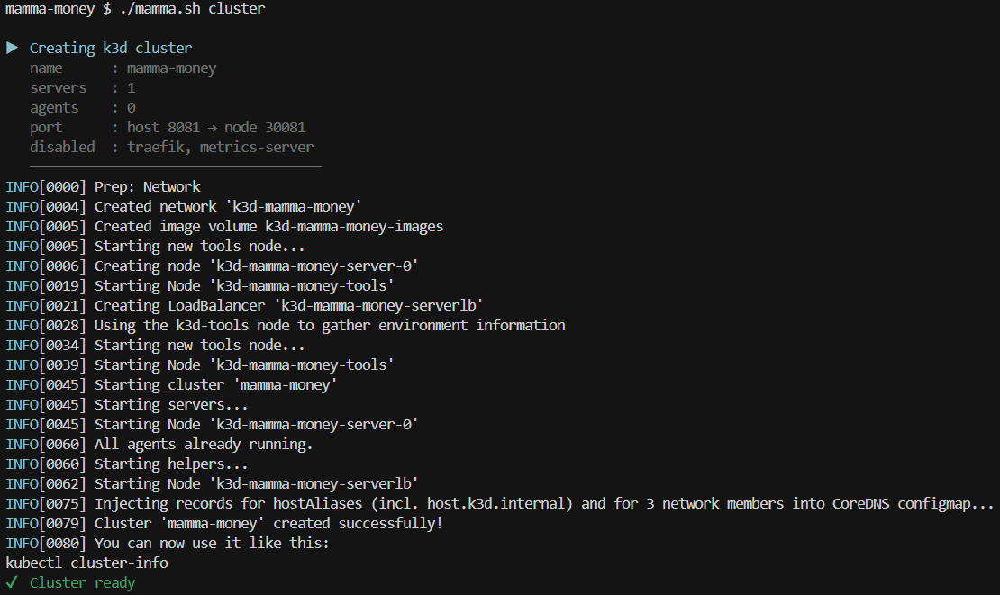
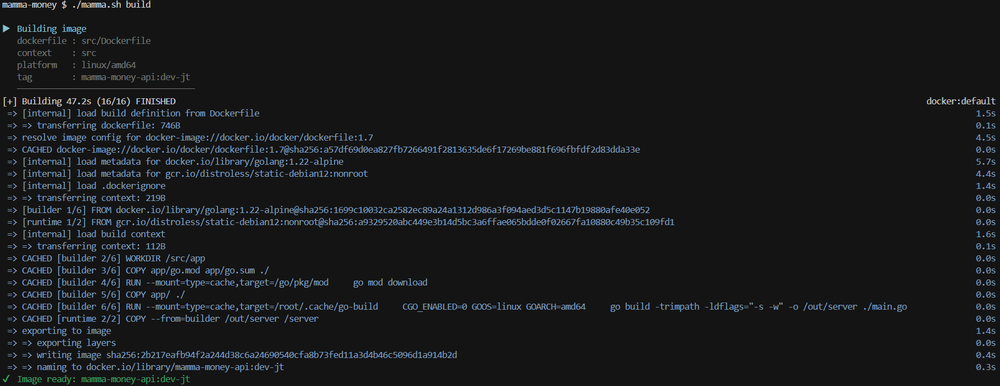
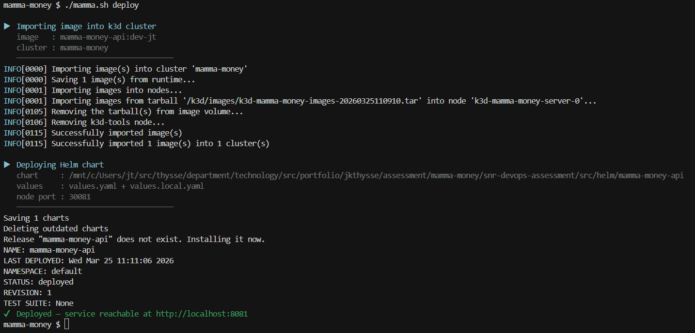

# Operations Scripts

## Context

The operator shell workflows have been consolidated into a single root entrypoint, `mamma.sh`. This change was made to improve maintainability, reduce script drift, and keep the operator experience simple.

## Architecture

The current ops workflow is structured as follows:

- `mamma.sh` is the primary command router and shared implementation.
- `ops/environment.sh` is the configuration bootstrap that loads `ops/.env`.

### Command flow

1. Operator invokes `bash ./mamma.sh <command>`.
2. `mamma.sh` sources `ops/environment.sh`.
3. `ops/environment.sh` resolves `.env` paths relative to its own location.
4. `mamma.sh` dispatches to a command handler:
   - `build|b`
   - `run|r`
   - `verify|v`
   - `all`
   - `cluster`
   - `deploy`
   - `down`
   - `menu`
5. The handler runs Docker/curl operations using configuration loaded from `ops/.env`.

## Design choices

### 1) Single source of operational logic

Moving build/run/verify behaviour into `mamma.sh` keeps the code DRY rather than duplicating logic across scripts. This centralises change management and keeps behaviour consistent.

### 2) Relative-path-safe environment loading

`ops/environment.sh` computes paths from `${BASH_SOURCE[0]}` and loads `ops/.env` from the script directory. This avoids failures when scripts are invoked from different working directories.

### 3) Dual operator UX: command mode and menu mode

`mamma.sh` supports non-interactive command mode for automation and scripting (`build`, `run`, `verify`, aliases `b/r/v`) and interactive menu mode for ad-hoc human operation (`bash ./mamma.sh`). The same handlers back both surfaces, so behaviour is identical regardless of how the script is invoked.

### 4) Fail-fast shell behaviour

`mamma.sh` uses strict shell mode (`set -euo pipefail`) to surface errors early and prevent silent failures in multi-step operations.

### 5) k3d load balancer retained

An earlier iteration of the cluster configuration used `--no-lb` to disable the k3d load balancer container and reduce memory footprint. This was removed because `--no-lb` is mutually exclusive with k3d port mapping — enabling it caused a fatal error at cluster creation:

```
FATA[0000] failed to transform ports: port-mapping of type 'proxy' specified, but loadbalancer is disabled
```

The load balancer is required for the `--port` mapping that exposes the NodePort on the host. Without it, the service can only be reached via `kubectl port-forward`, which requires a persistent background process and diverges from the Docker workflow. The resource cost of the load balancer container is negligible compared to the operational complexity of working without it.

### 6) Fixed NodePort with k3d port mapping over `kubectl port-forward`

The cluster is created with a fixed host-to-node port mapping (`HOST_PORT:NODE_PORT`), and the Helm chart is deployed with a matching `NodePort` service. This means `verify` works identically against both Docker and k3d without any reconfiguration — `BASE_URL` in `ops/.env` points to the same `${HOST_PROTOCOL}://${HOST_SERVER_NAME}:${HOST_PORT}` in both cases.

The alternative — relying on `kubectl port-forward` — would require a persistent background process, is fragile under network changes, and creates a divergent workflow between Docker and k3d. The trade-off is that `NODE_PORT` must not conflict with other services in the cluster, which is unlikely in a minimal local setup.

### 7) Cluster preflight check in `deploy`

`deploy` checks that the named k3d cluster exists before attempting to import the image or run Helm. Without this check, a missing cluster produces an opaque k3d or Helm error mid-operation. The preflight exits early with a clear message pointing the operator to `mamma.sh cluster`.

### 8) `values.local.yaml` as an explicit local override file with dynamic NodePort injection

Local k3d overrides are captured in `values.local.yaml` and committed to the repository, making local deployment configuration visible, reviewable, and consistent across machines. The base `values.yaml` is unchanged and remains valid for non-local environments.

`service.nodePort` is intentionally absent from `values.local.yaml`. It is injected dynamically at deploy time by `mamma.sh` via `--set service.nodePort="${NODE_PORT}"`, sourced from `ops/.env`. This means `NODE_PORT` is the single source of truth for the node port — changing it in `.env` flows through to both the cluster port mapping and the Helm service without requiring any manual edits to committed files.

An earlier iteration hardcoded `nodePort: 30080` in `values.local.yaml`. This caused a silent misconfiguration: when `NODE_PORT` was changed in `.env`, the cluster port mapping updated correctly but the Helm service continued to expose the old port, resulting in connection failures (`HTTP 000` from curl) with no obvious error message.

### 9) `HOST_PORT` as the single source of truth for the host port

An earlier iteration used two separate variables: `PORT` (for Docker and verification) and `HOST_PORT` (for the k3d cluster port mapping). These were required to always match, creating a silent misconfiguration risk — changing one without the other caused `verify` to fail with `HTTP 000`.

`HOST_PORT` was removed and replaced with `HOST_PORT`, which is used everywhere the host port is needed: Docker port binding, the `BASE_URL` for verification, and the k3d cluster port mapping. Changing `HOST_PORT` once in `ops/.env` is sufficient.

The Go application reads `PORT` as its internal listening port, not `HOST_PORT`. `mamma.sh` bridges the two by passing `HOST_PORT`'s value into the container as `-e PORT="${HOST_PORT}"`. This preserves the application's interface while keeping the operator configuration clean.

### 10) `teardown` renamed to `down`

The command was renamed from `teardown` to `down` for brevity and consistency with common container tooling conventions (`docker compose down`). The underlying function was renamed from `do_teardown` to `do_down` to match. All references — the command dispatcher, menu, and help text — were updated consistently.

### 11) Configurable cluster topology via `ops/.env`

Cluster shape (server count, agent count, port mapping) is driven by `ops/.env` variables rather than hardcoded in the script. This allows developers on different machines to tune their local setup without modifying shared code. All variables have defaults that produce a working minimal cluster out of the box, so no configuration is required for a standard setup.

## Trade-offs

### Benefits

- **Consistency:** One implementation for all operator workflows.
- **Maintainability:** Reduced script duplication and centralised change management.
- **Usability:** Supports both scripted and interactive operation from the same entrypoint.
- **Robustness:** Path-safe config loading, fail-fast shell mode, and preflight checks surface problems early.
- **Portability:** Works on Linux, macOS, and WSL2 without modification.
- **Local parity:** Fixed port mapping means `verify` behaves identically against Docker and k3d.
- **Single source of truth for ports:** `HOST_PORT` and `NODE_PORT` are the only values to change when reconfiguring ports — no duplication, no silent mismatches.

### Costs / limitations

- **Single script responsibility grows:** `mamma.sh` now owns more behaviour and may need occasional refactoring as features expand.
- **Menu complexity:** Interactive mode adds UX code that is not needed for CI/non-interactive contexts.
- **`all` semantics are intentionally simple:** `all` runs build + verify and expects a running container for verification; it does not orchestrate a detached run lifecycle.
- **k3d port conflict risk:** The fixed `NODE_PORT` could conflict with another service in the cluster, though this is unlikely in a minimal local setup.
- **`values.local.yaml` is committed:** Local override values are visible in the repository, which is intentional for transparency but means the file should never contain secrets.
- **`HOST_PORT` / app `PORT` indirection:** The mapping between `HOST_PORT` (operator config) and `PORT` (app env var) is implicit in `mamma.sh`. A developer reading the Dockerfile or Go source will see `PORT`; a developer reading `ops/.env` will see `HOST_PORT`. This is documented but adds a small cognitive overhead.

## Operational guidance

- Preferred day-to-day operator commands:
  - `bash ./mamma.sh build`
  - `bash ./mamma.sh run`
  - `bash ./mamma.sh verify`
- Short aliases are available:
  - `bash ./mamma.sh b`
  - `bash ./mamma.sh r`
  - `bash ./mamma.sh v`

## Local k3d deployment (WSL2)

For deploying to a local Kubernetes cluster on a resource-constrained machine, the workflow is:

```bash
# 1. Create the cluster (once)
bash ./mamma.sh cluster

# 2. Build the image and deploy to the cluster
bash ./mamma.sh build
bash ./mamma.sh deploy

# 3. Verify the service (same command as Docker verification)
bash ./mamma.sh verify

# 4. When done, reclaim resources
bash ./mamma.sh down
```

> Note on the assessment 'bonus' port (8081): the requirement suggests port-forwarding to `localhost:8081`. This repo instead uses a fixed k3d host port mapping (`HOST_PORT:NODE_PORT`) so `mamma.sh verify` runs against the same `BASE_URL` format used for Docker. The screenshots below reflect the default `HOST_PORT=8080`. To match the requirement exactly, set `HOST_PORT=8081` in `ops/.env` and rerun `cluster`, `deploy`, and `verify`.

**Evidence: local k3d workflow (screenshots)**

**1) Cluster creation (`bash ./mamma.sh cluster`)**



**2) Build + deploy (`bash ./mamma.sh build` + `bash ./mamma.sh deploy`)**





**3) Verify + kubectl checks (`bash ./mamma.sh verify`)**


### Cluster configuration

The `cluster` command is fully configurable via `ops/.env`. All variables have sensible defaults so no changes are required for a standard local setup.

| Variable | Default | Description |
|---|---|---|
| `HOST_PORT` | `8080` | Host port — used for Docker, verification, and k3d port mapping |
| `CLUSTER_NAME` | `mamma-money` | Name of the local k3d cluster |
| `CLUSTER_SERVERS` | `1` | Number of server nodes |
| `CLUSTER_AGENTS` | `0` | Number of agent nodes |
| `NODE_PORT` | `30080` | NodePort exposed by the cluster |

`HOST_PORT` is the single variable to change when running on a different port. It flows through to Docker port binding, the `BASE_URL` used by `verify`, and the k3d cluster port mapping automatically.

Developers who want a heavier local setup (e.g. a dedicated agent node) can override the relevant variables in their `ops/.env`:

```bash
CLUSTER_AGENTS=1
```

The port mapping means `verify` works identically against both Docker and k3d without reconfiguration.

### Helm values

`values.local.yaml` is applied automatically by `deploy`. It overrides:
- `image.pullPolicy: Never` — uses the locally imported image without attempting a registry pull
- `service.type: NodePort` — exposes the service via a fixed node port

`service.nodePort` is not hardcoded in `values.local.yaml`. It is injected dynamically at deploy time from `NODE_PORT` in `ops/.env` via `--set service.nodePort`. This ensures the node port is always consistent with the cluster port mapping without requiring manual edits to committed files.

The base `values.yaml` is unchanged and remains valid for non-local environments.

## Future considerations

- Add a dedicated `run-bg` command for detached execution and a paired `stop` command.
- Add preflight checks (port availability, Docker daemon status) before `run`.
- Add optional structured logging mode for non-interactive script usage in CI.